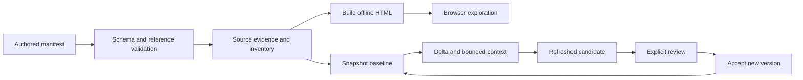

# Architecture and extension boundaries

repo-atlas has two execution environments: Node.js reads the source workspace and builds artifacts; the browser reads the embedded report data without a server. Both consume an explicitly authored manifest. The tool checks evidence and consistency, while the author remains responsible for business conclusions.

## Ownership

| Area | Files | Responsibility |
|---|---|---|
| CLI contract | `scripts/cli-lib.mjs` | Typed option categories, positionals, help and usage errors; no filesystem operations |
| Manifest structure | `schemas/atlas.schema.json`, `scripts/schema-lib.mjs`, `scripts/manifest-lib.mjs` | Local schema, reference checks, diagnostics and relocation of editor links |
| Evidence | `scripts/evidence-lib.mjs` | Anchors, excerpts, hashing and literal redaction |
| Filesystem writes | `scripts/io-lib.mjs` | Containment, input identity protection, atomic writes and replacement policy |
| Inventory and baseline | `scripts/snapshot-lib.mjs`, `scripts/git-lib.mjs` | File groups, source hashes, evidence reverse index and verified historical content |
| Incremental workflow | `scripts/delta.mjs`, `scripts/context.mjs`, `scripts/refresh.mjs` | Changes, bounded review input and candidate generation |
| Acceptance | `scripts/review-lib.mjs`, `scripts/review.mjs`, `scripts/accept.mjs` | Task bindings, explicit decisions and new version publication |
| Delivery inspection | `scripts/compare.mjs`, `scripts/check-delivery.mjs` | Semantic knowledge changes and bound artifact integrity |
| Report | `scripts/build.mjs`, `assets/report/` | Compile the manifest and vendor assets into one offline document |

## Invariants to preserve

1. A path, class name or comment alone is not proof of a business relationship. Missing/ambiguous anchors must remain explicit.
2. A review binds the exact candidate, baseline and source state. Source drift cannot silently inherit approval.
3. Runtime metadata must not erase business JSON. Normalize only known schema locations; `flags[].value` is arbitrary JSON.
4. Output checks use canonical paths and file identities, including hard links. New commands must reuse the shared write primitives.
5. Inventory caches are scoped to one collection. Overlapping groups share physical reads but retain independent filters and visited sets; evidence files are still rehashed.
6. Report delivery remains a standalone HTML file. Refactoring frontend source is allowed; adding a CDN or requiring a server changes the product contract.
7. A smaller context must explicitly record omissions. Historical text must match the saved baseline and known redaction policy.

## Adding a command or field

Use the shared CLI parser with explicit boolean/value options and positional counts. Keep operational failures distinct from usage failures. Declare the command's path base and replacement policy in [CLI reference](cli.md).

For manifest changes, update schema, runtime normalization, editor/example coverage and reference validation together. Consider snapshots, semantic comparison, review task bindings, redaction and report rendering, not just build success. If a persisted format changes, document a migration or explicit baseline recreation requirement.

Testing guidance and the local CI equivalents are in [CONTRIBUTING.md](../CONTRIBUTING.md). Frontend logic remains in `assets/report/app.js`; splitting it should follow identifiable responsibilities and preserve the three-browser interaction checks, rather than adding a bundler solely to increase module count.
