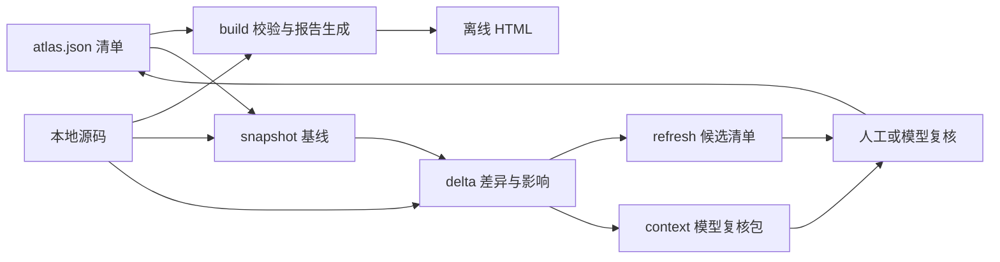

**repo-atlas 深入分析与改进建议 · 2026-09-28**

本文保留优化前的分析与复现记录，不代表当前实现仍有全部问题。同日后续已完成前端阅读与导航改进，以及共享证据、v2 基线、增量身份校验、输出保护、阶段归属和复核队列等修复。完成范围、验证和剩余扩展项见[改进交付记录](2026-09-28-improvement-delivery.md)。可查看[更新后的中文预览](../../tmp-frontend-optimized/report.html)和[浏览器验证结果](../../tmp-frontend-optimized/report.verification/result.json)。

当前项目已经把源码证据、离线交付、多业务链路和增量上下文串成了一条可用主线。最需要优先解决的是这条主线各环节对“同一份证据、同一个基线、同一个复核状态”的理解不一致。现阶段继续增加视图种类，会放大这些不一致带来的维护成本。

建议按“正确性与边界 → 可维护的数据模型 → 复核工作流 → 规模与体验”的顺序推进。保留无运行时 npm 依赖、单文件离线报告和人工确认业务语义这三个特点。

**分析范围与实际验证**

- 基线：`main`，提交 `adf757816bdc9ae083f48560e29ba11c466b271f`；以当时工作区内容为准，包含原有 11 个未提交修改文件。
- 已检查：全部 8 个脚本、报告前端与模板、清单契约、技能说明、测试夹具、CI 和发布元数据。
- 环境：Windows，本次 Node.js 为 `v24.11.1`，浏览器验证实际使用本机 Chrome。
- 原有 `npm test` 通过。另建 12 个隔离 CLI 样例，12 个均复现了对应问题；补充的多仓库样例也复现问题。
- 项目自带 `verify.mjs` 在多链路夹具上失败，具体是链路证据按钮等待超时。随后独立浏览器检查确认了状态展示问题，并检查了 1440px 桌面、320px 手机截图。手机样例未发现水平溢出。
- 没有连接实验室服务器。没有修改项目原有实现、提交代码或上传文件。新增正式产物为本分析文档；复现代码和合成数据位于被忽略的 `tmp-review-20260928/`。
- 未执行大仓库压力测试、完整浏览器矩阵、Node.js 全版本矩阵或第三方依赖漏洞审计。下文性能判断区分代码结构观察与实际测量。

复现材料：[CLI 样例](../../tmp-review-20260928/probe.mjs)、[12 项结果](../../tmp-review-20260928/results.json)、[多仓库样例](../../tmp-review-20260928/multirepo.mjs)、[多仓库结果](../../tmp-review-20260928/multirepo-results.json)、[浏览器检查代码](../../tmp-review-20260928/browser-check.js)、[自带验证器失败记录](../../tmp-review-20260928/run-1s64Fd/browser/report.verification/result.json)。这些临时材料适合本地复核，不应把其中的完整合成仓库作为正式项目源码提交。

**1. 项目真正的核心，以及目前的结构性问题**

当前处理链路如下。业务结论由分析者维护，程序负责验证、抽取、索引和展示。



这张图中最重要的资产是“结论与当前源码的对应关系”。HTML 是它的交付界面，快照是它的历史依据，增量包是维护它的工具。

但当前实现存在三组独立逻辑：`build.mjs` 自行校验与提取证据；`snapshot-lib.mjs` 自行遍历与解析；`context.mjs` 再次解析并读取 Git 历史。它们已经在歧义锚点、文件范围、阶段身份和历史版本上产生差异。单个文件行数不算特别大，职责和契约重复才是主要维护问题。

另一处限制是数据模型：`module.links` 只有目标 ID，Mermaid 是独立字符串，源码证据附在实体上。程序可以证明“一段源码存在”，但很难验证“这条调用边由哪段源码支持”，也无法可靠地把一个未直接引用的源文件映射回模块。

**2. 优先级总览**

这里的 P1 表示应在进一步推广增量工作流前修复，P2 表示下一轮模型与工程治理应处理；不是通用安全漏洞评级。

| 优先级 | 问题 | 已确认的后果 |
|---|---|---|
| P1 | diff 未应用显式脱敏 | 同一上下文包中，摘录已遮盖，diff 仍保留相同测试字面值 |
| P1 | 输出路径与覆盖约束不统一 | 增量工具可沿 junction 写出声明工作区，refresh 可覆盖输入清单 |
| P1 | 文件分组共享遍历去重状态 | 同一目录的第二种后缀被快照漏扫，报告却正常列出 |
| P1 | 未引用源码缺少影响归属 | 文件已经变化，受影响实体仍为空，候选无需复核 |
| P1 | 历史内容与快照基线不一致 | dirty 快照的“旧摘录”来自 HEAD，哈希与快照记录不符 |
| P1 | 不校验 delta 与当前内容的一致性 | 接受旧 delta 的哈希，同时打包更新后的源码 |
| P1 | 证据解析规则不一致 | build 拒绝歧义锚点，snapshot 却标记 resolved |
| P1 | 覆盖状态展示不准确 | 链路有 unknown 阶段，标题仍显示“已覆盖” |
| P1 | refresh 相对路径定位有误 | 从清单目录执行后，候选工作区指向错误父目录 |
| P2；多仓场景下应提升至 P1 | 增量 Git 基线未按仓库维护 | 声明两个子仓库，context 仍在聚合目录取历史，diff 为空 |
| P2 | 阶段身份与运行期状态未贯通 | 链路待复核、阶段不标记；上下文没有选中独立阶段实体 |
| P2 | 显式旧清单覆盖不生效 | `--previous-manifest` 被快照摘要索引优先级压过 |
| P2 | 浏览器回归本身中断、CI 覆盖单一 | 当前多链路样例的验证在进入图表检查前就超时 |

**3. 优先修复项：原因、证据与验收方式**

**3.1 脱敏必须覆盖整个上下文输出通道。**

`scripts/context.mjs:79` 直接运行 Git diff 并截断；`121` 把结果写入 `changedFiles[].diff`。`109` 的 `redact` 仅处理证据摘录。修改夹具里含测试标记的代码行后，`evidence.current.text` 已出现 `[REDACTED]`，但 diff 中仍存在被要求遮盖的原值。现有测试 `scripts/test.mjs:42` 只检查摘录，因此无法发现这一问题。

这是已配置隐私规则在不同输出字段间不一致，不表示本次发生真实凭据外泄。复现仅用了项目自带合成字面值。

建议按源文件收集显式遮盖规则，对新旧摘录、diff、可能包含源码内容的诊断信息使用同一处理器；对没有 Git 历史而回退读取当前文件的路径也遵循同样规则。对旧清单和新清单规则如何合并应有明确契约。

验收：完整序列化后的 `context.json` 不含指定测试字面值；同时覆盖删除行、新增行、上下文行、文件重命名及旧值替换。不要把这一测试扩张为“能够检测所有秘密”的承诺。

**3.2 增量写入边界需要与 build 保持一致。**

`scripts/build.mjs:31` 会检查输出祖先的真实路径；`scripts/snapshot-lib.mjs:285` 的 `assertOutputInside` 只检查词法路径。构造 `.repo-atlas` 指向声明工作区外的 junction 后，`snapshot.mjs` 成功向目标目录写入了文件。复现目标仍在本次隔离目录内，没有触碰外部用户文件。

另外，`scripts/refresh.mjs:14`、`47` 没有拒绝 `output === manifestPath`，合成样例中的 `--output atlas.json` 直接覆盖了输入清单。这与“候选不覆盖基线”的文档约定不同。`delta --snapshot-output` 虽防止直接覆盖 `--from`，其他输出组合仍需统一检查。

建议集中实现输出规划：真实祖先边界检查、输入/输出身份比较、显式覆盖语义、临时文件写入后替换。路径约束要覆盖输出文件自身已有链接的情况；原子写入的目标是避免中途失败留下半份 JSON。

验收：普通文件、已存在文件、符号链接/junction、同路径、不同写法指向同一文件均有边界测试；越界目标不得被写入。

**3.3 文件范围和影响范围必须明确分开。**

`scripts/snapshot-lib.mjs:162` 创建了跨分组共享的 `seen`，`134` 在处理后缀之前就跳过已经遍历的目录。两个分组分别扫描 `src` 下的 `.js` 和 `.ts`，第二组的 TypeScript 文件未进入快照；而 build 每组使用自己的 `visited`（`scripts/build.mjs:263`），因此 HTML 文件索引包含它。报告范围和增量基线由此不一致。

更深一层，`scripts/delta.mjs:56` 的影响查找仅依赖证据反向索引。修改 fileGroups 范围内、尚未被 sources 引用的普通实现文件时，实际结果是 `changedFiles=1`、`impacted=[]`、`reviewRequired=false`。当前清单没有模块路径归属，程序也就无法实现技能说明中“普通实现变更影响所在模块”的完整语义。

建议把目录遍历、文件去重、分组匹配拆开：目录可以扫描一次，但每个文件需要匹配全部分组。引入模块文件范围或显式归属索引；归属不明确的变更进入 `unmappedChanges` 待分派队列，不能显示成已经无需复核。影响结果应说明是直接证据、文件归属、关系传播还是公共配置规则导致。

验收：调整分组顺序不改变文件并集；新增或修改未引用文件必须得到归属或显式缺口；fileGroups 之外的文件不擅自扩大进范围。

**3.4 一个快照需要能确定它自己的历史内容。**

快照计算的是工作区文件哈希，但 `scripts/context.mjs:95` 从 `baseline.git.commit` 执行 `git show`。当快照包含未提交修改时，两者不是同一版本。合成样例中，快照包含 `dirty-baseline`，context 的旧摘录却是提交中的原值，旧摘录哈希不等于基线的 `excerptSha256`。

没有 Git、基线文件未跟踪、源文件重命名或者证据定义改动时，也不能假定用当前锚点和当前路径到 HEAD 中查找能得到原证据。当前 `context.mjs:135` 正是用当前 source 重新提取旧摘录。

建议优先保存经过显式遮盖的基线证据摘录及其来源版本。完整文件 diff 只有在能够定位准确旧版本时才生成；无法恢复时输出 `previousUnavailable` 及原因。如果需要支持 dirty 基线的完整 diff，应额外设计本地内容存储及保留策略，不能仅靠 commit 字段表达它。

验收：干净仓库、dirty、未跟踪文件、无 Git、重命名、证据锚点修改分别测试。旧摘录必须与基线匹配；无法匹配时明确缺失，不呈现其他历史版本。

**3.5 delta、manifest、源码之间缺少一致性校验。**

`context.mjs:24` 读取 baseline 和 delta 后，没有核对它们是否属于当前清单、同一个快照或同一份当前源码。先生成 delta，再修改源码，再打包 context，工具仍成功；输出 `newSha256` 属于前一次变更，而 `current` 摘录包含后一次变更。

`refresh.mjs` 同样直接接受 delta。工作流程越长，这种读到不同时间状态的机会越多。

建议让 delta 记录基线身份、清单语义哈希和当前文件哈希集合的身份；消费 delta 时校验。可在检测到漂移时要求重算差异，或明确输出 drift 状态并禁止把当前材料标成匹配该 delta。将扫描期间的文件变化也作为可检测状态。

验收：故意串用另一清单/仓库的 delta，或者在扫描和打包之间改源码，均不能生成表面自洽的复核包。

**3.6 统一证据解析器，并保留“未显式指定 occurrence”的信息。**

`scripts/build.mjs:65` 拒绝未指定 occurrence 的重复锚点；`snapshot-lib.mjs:76` 先把缺省 occurrence 变为 1，`242` 之后只检查第一个匹配是否存在。`context.mjs:102` 又实现了一份同样宽松的解析。给夹具增加第二个相同锚点后，build 失败，snapshot 却仍标记 `resolved=true`。

文件变化通常仍会让 delta 把该证据列入待复核，因此不能把此问题描述为“所有歧义都不会进入 stale”。准确问题是：快照和上下文错误地给出了已解析结果，并可能在后续快照中继续复用这种歧义结果。

建议统一输出 `resolved | missing | ambiguous | invalid`，包含匹配数、位置、摘录哈希和失败原因。显式 `occurrence=1` 与未填写应保留区别。长度范围、redact 数组及 source 类型校验也应共享。

验收：相同 source 定义在 build、snapshot、context 中得到相同解析状态；唯一锚点变重复、出现次数越界、无效长度和缺失文件均覆盖。

**3.7 覆盖状态、新鲜度与可信度需要分别计算和展示。**

`assets/report/app.js:131` 只要链路不需要复核，就直接显示“已覆盖”，没有聚合阶段覆盖状态。浏览器样例中 `audit_order` 存在一个 unknown 阶段，标题仍是“已覆盖”。

`app.js:420` 把 not_applicable 计入总阶段数。将该链路变成两个 covered 加一个 not_applicable 后，“已覆盖”筛选仍排除了它。同时 partial 使用 0.5 权重，容易给出看似精确但语义不明的覆盖百分比。

此外，`freshnessBadge` 只显示 stale；`unresolved`、`historical` 并没有对应展示，阶段也未显示 freshness。知识已经被确认过，不代表当前源码仍然支持它；这两个状态应同时保留。

建议定义统一聚合函数，供目录、详情、统计、筛选共同使用。展示“适用阶段已覆盖 2/2；不适用 1”，对 partial、unknown 给出数量和下一步；覆盖状态独立于 `reviewRequired` 与事实可信度。历史或未解析证据必须有明确标志。

验收：同一链路在所有位置状态一致；unknown 不出现“全覆盖”；not_applicable 不降低适用范围覆盖；stale 阶段能从任何入口进入复核。

**3.8 refresh 的路径语义要以清单文件身份为准。**

`scripts/refresh.mjs:14` 用调用时的 `manifestArg` 推导默认候选路径，却将它解析到 workspace。对于 `docs/atlas.json` 中 `workspace=".."` 的常见结构，从 `docs` 目录运行 `refresh.mjs atlas.json`，输出到了仓库根目录的 `atlas.next.json`，其中 workspace 仍为 `..`。候选由此指向仓库父目录。

建议默认候选位于绝对 manifestPath 的同目录。允许显式输出到其他位置时，重新计算 candidate.workspace，保证它始终指向原工作区；也可明确拒绝会改变语义的输出位置。

验收：从仓库根、清单目录和外部目录执行相同输入，候选解析到相同工作区、源码和 HTML 输出位置。

**4. 增量模型的下一轮治理**

**多仓库应有逐仓库基线。** build 已遍历 `manifest.repositories`（`scripts/build.mjs:288`），快照却只执行 `gitInfo(bundle.workspace)`（`snapshot-lib.mjs:269`）。context 的 Git 命令也只在 workspace 运行。复现中配置 alpha、beta 两个仓库，快照记录聚合仓库提交，子仓变更虽然被哈希检测到，却没有 diff 和旧摘录。建议每个文件绑定 repositoryId，快照保存 `repositories[id] = {root, commit, dirty, ...}`，Git 路径按该仓库重新定位。Git 命令失败应保存原因，区别“无差异”和“无法读取”。

**阶段必须有稳定、独立身份。** `snapshot-lib.mjs:84` 只把阶段 ID 放进 evidence key，`entityId` 仍使用父链路 ID；context 虽注册 `chain:id/stage`，delta 却不产生这类影响实体。`refresh.mjs:40` 只更新链路，未递归 stages。复现结果是父链路待复核、阶段零标记、上下文零独立阶段实体。建议采用明确的 `chain-stage` 类型和父子关联，直接变化定位到阶段，父链路由阶段状态聚合。

**运行期字段的哈希过滤要递归一致。** `analysisManifestHash` 只剔除集合顶层 freshness，给阶段添加 freshness 仍改变分析哈希并可能触发全量复核。建议使用共享清单规范化模型，不在多个脚本维护不同版本的运行期字段排除列表。

**明确覆盖参数优先级。** `context.mjs:191` 先读取快照摘要索引，再回退显式旧清单，违背 `--previous-manifest` 的覆盖约定；按 `${type}s` 找旧集合还不能正确处理 `coverage`。建议使用显式集合映射，旧清单优先，并保留“用户明确提供空摘要”和“没有找到”之间的区别。

**影响传播要控制漏报与过度复核。** 当前基础设施判断是路径正则，任意 YAML/SQL 可能触发全量，而部分路由/配置实现文件不匹配；清单语义哈希变更也直接全量。建议区分清单展示字段、证据定义、关系拓扑和分析范围；新增可配置的公共文件规则；保留每次扩散的依据。阈值仍可作为兜底，但应允许项目规模和复核成本不同的团队调整。

**稳定证据 ID 有助于长期维护。** 当前 key 包含 sources 数组下标，在数组前插入一项会改变后续身份。可以引入 evidence 注册表和稳定 ID，由模块、视图、阶段引用；改变顺序不会造成大量身份变动，也便于共享摘录、统计唯一证据和保留复核记录。

**5. 让项目的分析能力更可靠，也更省人工**

当前业务语义由人工或助手维护是合理定位，但需要更好的输入辅助和更明确的边界。

| 能力 | 当前限制 | 建议 |
|---|---|---|
| 关系可追溯 | links 只有目标 ID，图表字符串与关系分离 | 增加可选 `relations`：来源、目标、关系类型、证据、可信度，逐步让部分视图从关系生成 |
| 分析范围 | 文件范围与模块归属没有直接映射 | 增加模块 include/exclude 或文件归属表，并显示未分派变更 |
| 事实与来源 | 有锚点即可通过结构校验 | 区分结构通过、证据解析通过、语义已复核；关键关系允许引用调用点和实现两端 |
| 编写清单 | 直接手写大量 JSON，首次错误中止 | JSON Schema、编辑器补全、`validate --json`、错误列表带字段路径，提供最小真实夹具 |
| 复核候选 | refresh 主要给旧结论加 stale 标记 | 生成有原因、旧新证据、待办和复核记录的队列；确认后再建立新基线 |
| 无法恢复的证据 | 正式 build 严格拒绝缺失是合理的，但复核候选也难预览 | 若增加 review-only 报告，明确显示 unresolved，不沿用旧摘录冒充当前事实 |

不建议立刻引入完整跨语言 AST 引擎。先做文件归属、关系证据和共享解析器；以后可让语言适配器提供符号定位或候选关系，仍保留人工语义确认和字面锚点回退。

建议复核记录至少包含：证据身份、检查时的源码哈希、结论、复核时间和下一步。仅清除 stale 不能证明真的完成过复核。接受候选的操作要在源码未继续漂移时才更新正式基线。

**6. 性能：先控制数据量和重复工作，再考虑并发与前端框架**

本次小夹具生成的 HTML 为 **3,787,865 字节**；Mermaid 与 Lucide 两个文件合计 **3,694,556 字节**，约占 **97.5%**。这首先是离线打包的固定成本，不应据此推断大项目性能良好或糟糕。

下列成本已能从实现确认，实际耗时和峰值内存尚需规模测试：

| 位置 | 当前成本 | 优先改进 |
|---|---|---|
| `build.mjs:55`、`:278` | 文件索引为了行数读取全文，并保留在缓存直到构建结束 | 非证据文件用流式计数或可选行数；只保留需要的证据文本 |
| `build.mjs:60`、`snapshot-lib.mjs:241` | 每条证据重新分行并扫描同一文件 | 每个文件一次解析；按锚点批量匹配，缓存解析中 Promise 避免并发重复读取 |
| `snapshot-lib.mjs:138`、`:187` | 文件遍历、stat、hash 基本串行 | 在统一遍历正确性后引入有上限的 I/O 并发；不要无界 Promise.all |
| `context.mjs:65`、`:114` | 每个文件同步启动 Git，Promise.all 不会让同步子进程并行 | 按仓库批量 diff，历史内容可批量读取；保存失败和截断原因 |
| `context.mjs:78` | 每份 diff 最多 12,000 字符，但整个包无预算 | 增加总字节/估算 token 预算、优先级与省略清单；一跳关系也受预算控制 |
| `app.js:534`、`:568` | 每次输入对全部实体重新 JSON.stringify，再过滤 | 构建或加载时生成搜索索引，缓存标准化文本；大量结果分页或虚拟化 |
| `app.js:236` | 快速切换会排队渲染已过期视图，完成后才丢弃结果 | 开始渲染前检查序号，限制 SVG 缓存；必要时再评估渲染隔离 |

证据摘录目前也会在模块、链路、阶段中重复序列化。共享 evidence registry 能同时减少 HTML 大小、搜索数据量和复核重复项，比单纯压缩 HTML 更直接。

建议建立三档合成基准：1,000 / 10,000 / 50,000 文件，分别控制证据数、链路数和变更率。记录冷构建耗时、增量耗时、峰值 RSS、HTML 字节、context 字节和搜索延迟。先采样再制定门槛；本报告不声称已跑过这些档位或能提升某个百分比。

对于固定资产体积，可以以后提供图表精简包、图标子集或者目录式导出，但应保留当前单文件离线默认，不为小报告引入服务端运行要求。

**7. 阅读体验：让读者更快抵达正在看的链路**

桌面和手机截图反映的主要问题是信息顺序。切到某条链路的说明页后，全局统计、全部链路目录、全局质量提醒依然排在当前流程之前。样例只有两条链路，在 320px 手机屏上，真正的阶段说明仍位于很深的位置；链路数量增加后，阅读成本会进一步放大。

建议首页提供项目目的、边界、主要链路和关键发现；链路页先展示当前触发、结果、阶段和待确认项，再折叠其他链路与全局统计。质量提醒按当前链路筛选，保留查看全部入口。

证据详情目前复用一个弹窗并替换内容，从链路进入摘录后没有返回上一层的路径。自带验证器失败正好暴露了这个交互模型。可以加入弹窗内返回导航或侧栏详情，保持“链路 → 阶段 → 证据 → 返回链路”的连续阅读。

其他低成本改进：

- `project.summary` 已被 build 写入，app 中尚未消费；可用它解释项目目的，而不是只显示计数。
- `app.js:166` 使用 `history.replaceState`，视图切换不积累浏览器历史；可让链路、阶段、发现项有可复制的深链接，并保留返回和滚动位置。
- 阶段 kind 的 `side_effect`、`orchestration` 等机器值用本地化标签展示，原值放辅助信息。
- 对大量链路增加模块、入口类型、缺口、待复核原因筛选；搜索结果给出命中字段和摘录，避免只截取前几个无提示结果。
- `app.js:442` 一次渲染全部链路卡片，目录宜支持折叠/分页；这个调整同时改善手机体验和 DOM 规模。
- CI 增加键盘返回、弹窗焦点、320px 长名称与真实长链路场景。按钮存在可访问名称只能覆盖无障碍的一小部分。

本次截图：[桌面状态矛盾](../../tmp-review-20260928/narrative-desktop.png)、[手机信息顺序](../../tmp-review-20260928/narrative-mobile.png)。手机截图是在浏览器内将末阶段改成 not_applicable 的合成检查状态下取得，不是原始夹具截图。

**8. 工程组织与测试策略**

推荐逐步拆成共享库，而不是一次性重写：

```text
scripts/                   命令行参数、调用、退出码
lib/manifest/              清单规范化、版本、结构与引用校验
lib/evidence/              统一路径解析、锚点解析、摘录、脱敏
lib/inventory/             文件枚举、归属、哈希、逐仓库 Git 基线
lib/incremental/           差异、影响传播、漂移检查、候选与上下文
lib/output/                路径边界、原子写入、覆盖规则
assets/report/             展示模型、渲染与交互
```

库函数接受显式数据并返回结构化结果，CLI 再负责读写与退出码。这样可直接单测证据与影响逻辑，不必每条断言都启动子进程。保留少量 CLI 端到端用例，检查真实文件、Git 和路径行为。

当前 `scripts/test.mjs` 只有一个多链路夹具，主要变更动作是在一个文件末尾追加常量；它检查快照、差异、上下文与 HTML 数据，但没有调用 refresh。`.github/workflows/ci.yml` 只在 Ubuntu / Node 20 执行此测试，未覆盖本项目常见的 Windows 路径场景和可选浏览器回归。

`scripts/verify.mjs:70` 点击阶段摘录后关闭弹窗，`:75` 又点击已不存在的链路级来源按钮，实际超时 30 秒。应重新打开链路或明确返回，再断言下一步。此次运行未进入后续图表、导出和移动检查，不能把这次失败结果写成“这些功能已经验证通过”。

建议建立以下小而有针对性的测试集合：

| 组别 | 必须覆盖的行为 |
|---|---|
| 证据契约 | 唯一/歧义/显式 occurrence、缺失、长度、完整输出脱敏 |
| 文件与边界 | 多分组同目录、链接越界、中文及空格路径、同输入输出、候选定位 |
| 基线 | clean、dirty、无 Git、未跟踪、多个仓库、历史不可用 |
| 增量影响 | 未引用文件、阶段独立身份、关系传播原因、manifest 改动、漂移 |
| 复核闭环 | snapshot → delta → context → refresh → 复核 → build → 新 snapshot |
| 浏览器 | 含 unknown/partial/not_applicable/stale 的链路、弹窗返回、叙述视图、缺失证据、320px |

CI 可先覆盖 Windows + Linux、当前承诺的最低 Node 版本和一个受支持的 LTS，再明确是否调整最低版本；浏览器任务使用固定版本环境。运行时不依赖 npm 包不妨碍在开发/CI 中固定测试工具版本。

发布治理方面：为 manifest 增加明确 schemaVersion 和迁移规则；为 CLI 提供严格选项定义、统一帮助、机器可读错误码；维护固定 vendor 文件的来源版本和校验和。不要仅凭版本较旧推断第三方包存在漏洞，本次没有做这一审计。

**9. 推荐实施顺序和完成标准**

| 阶段 | 工作 | 完成标准 |
|---|---|---|
| 第一阶段：收紧正确性 | 统一证据解析与脱敏、输出边界、修复分组漏扫、候选路径、覆盖状态和验证器中断 | 本报告对应回归样例全部转为预期安全/一致行为；现有正常场景继续通过 |
| 第二阶段：基线与影响 | dirty/逐仓历史、delta 身份与漂移检查、模块归属、阶段身份、运行期字段规范化 | 任意变更都有明确影响或未分派状态；旧新材料与标注版本一致 |
| 第三阶段：复核产品化 | 结构化诊断、复核队列、稳定证据 ID、关系模型、深链接和链路页信息顺序 | 读者能从变更定位原因、核对证据并确认候选；不需要手工拼接状态 |
| 第四阶段：规模化 | 建立基准，按测量优化读取/解析/Git 批处理/搜索/上下文预算 | 发布可重复的规模与资源指标，并在 CI 保持关键预算 |

如果只能选一个起点，选择“共享证据与基线模型”。它直接支撑可信度，也能消除重复解析、减小数据量、简化测试。当前项目的优势已经在于可追溯和离线维护，下一轮工作应让这两点在复杂仓库、未提交改动和多次增量复核后仍成立。

**10. 前端交付产物专项评价（同日补充）**

目前适合作为研发内部使用的离线分析工具，视觉风格与交互能力已经形成统一基础。作为接手复杂项目时直接交付给读者的报告，信息组织、核心结论表达和连续阅读仍需明显改进。

本轮重新打开现有合成报告检查总览、链路、索引及证据弹窗，并测试搜索、放大/适应画布按钮、Mermaid 源码查看和 SVG 下载。图表渲染成功，搜索与证据内容检查成功，收到 SVG 下载事件，本轮检查未捕获 pageerror。这是专项抽查，不能替代此前中断的完整浏览器回归。

| 维度 | 评价 | 实际观察 |
|---|---|---|
| 视觉一致性 | 较好 | 中性色、绿色强调、细边框和图标语言统一，具备文档工具感 |
| 长时间阅读 | 需要改善 | 大量说明为 10–12px，阶段摘要为 11px；卡片留白多，但正文仍偏小 |
| 信息层级 | 当前主要短板 | 总览、链路详情、证据索引都重复展示统计、全部链路和质量提醒 |
| 图表探索 | 小样例可用 | 三节点图渲染成功，可缩放、查看源码、导出 SVG；密集图尚无充分样例验证 |
| 证据追溯 | 有基础，连续性弱 | 文件路径、起始行和摘录可查看；弹窗替换内容后没有返回前一层的入口 |
| 手机交付 | 布局适配基本成立，任务效率偏低 | 320px 没有水平溢出，但当前流程说明位于首屏之后较深位置 |
| 状态表达 | 必须修复 | 存在 unknown 阶段的流程仍被标“已覆盖” |

页面位置测量（浏览器 CSS 像素，样例只有 2 条链路）：

- 1440 × 1000：总览图区域顶部约 `690px`。
- 1440 × 1000：证据索引区域顶部约 `887px`。
- 320 × 740：流程说明区域顶部约 `1117px`。

因此，“页面没有溢出”并不足以说明交付体验良好。进入总览应尽快看到系统主关系；进入索引应尽快搜索到证据；进入链路应尽快读到当前阶段。现在这些任务都被重复的全局内容延后。

推荐明确三类页面职责：总览先解释项目目的、核心关系和关键发现；链路页先展示当前触发、阶段、结果、异常和缺口；证据页先展示搜索、筛选、基线和来源列表。统计、其他链路和质量提醒移到次要区域或折叠展示。

可保留现有色彩、图标和卡片基础，优先调整内容顺序、正文尺寸、证据返回导航和状态聚合。阶段正文可先尝试 14px、1.6–1.8 行高，再用真实中文长内容验证；辅助标签可以继续紧凑。源码弹窗增加逐行行号、锚点高亮及当前结论上下文，比单纯扩大弹窗更有用。

图中文字与连线含义也依赖清单质量。当前夹具直接使用 api/worker/audit 三个简短节点，不能把这个样例的内容简略归因于模板，也不能用它证明复杂架构图已经足够易读。下一次前端验收应加入多模块、长中文标签、多条业务链、失败恢复和多证据来源的代表性样例。

截图：[桌面总览](../../tmp-review-20260928/frontend-overview.png)、[证据弹窗](../../tmp-review-20260928/frontend-evidence.png)、[证据索引](../../tmp-review-20260928/frontend-catalog.png)、[手机流程](../../tmp-review-20260928/frontend-mobile.png)。检查脚本：[frontend-check.js](../../tmp-review-20260928/frontend-check.js)。
