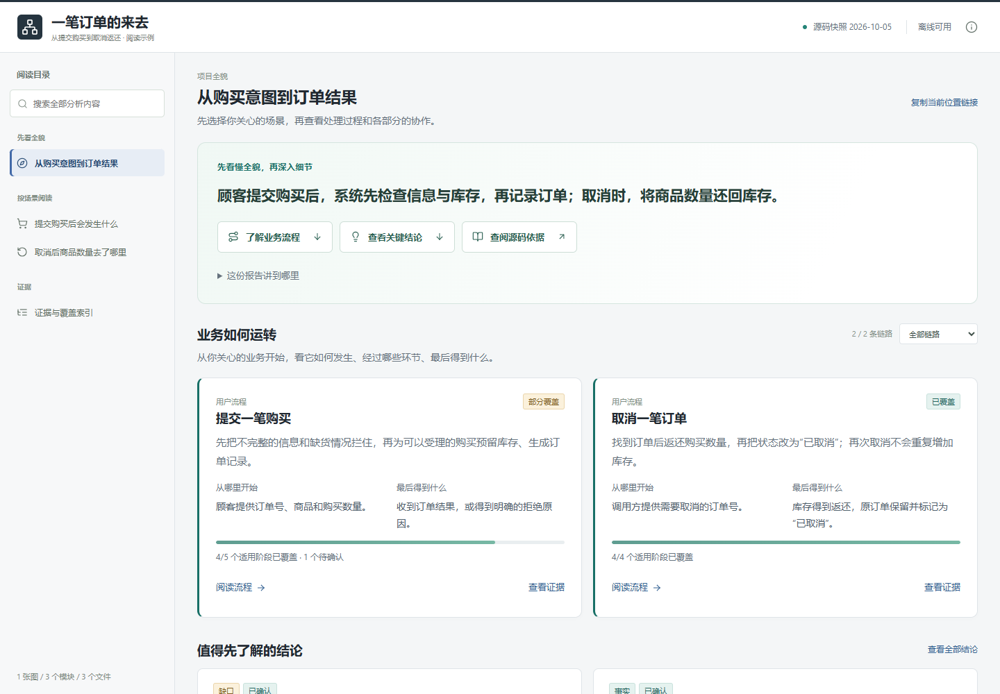

# 一笔订单的来去

这个中文示例展示一份面向读者的报告：先讲业务用途，再按“提交购买”和“取消订单”两个场景解释过程，最后按需查看源码依据。

在仓库根目录运行：

```sh
node scripts/validate.mjs examples/order-journey/atlas.json
node scripts/build.mjs examples/order-journey/atlas.json
```

直接打开本目录生成的 `report.html`。再次生成同一文件时追加 `--replace`。报告完全离线，生成的 HTML 不提交到仓库。



- [atlas.json](atlas.json)：标题、业务步骤、结论和证据的位置。
- [src/](src/)：用于支撑示例说明的合成源码。
- [写作规则](../../references/reader-experience.md)：让标题和正文使用业务语言，技术符号留在细节中。

示例中的订单和库存只保存在内存中，没有声称已接入支付、物流或持久化存储。它用来展示报告写法，不是可部署的商城实现。
